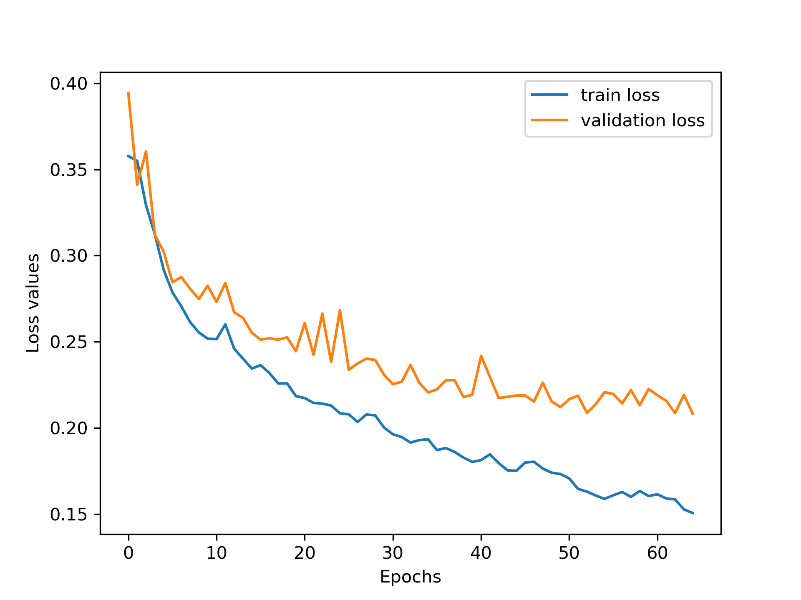

# Drug Blood-Brain Barrier Penetration (BBBP) Prediction
**A Graph Neural Network (GNN) approach to predict blood brain barrier permeability of small molecules.**

## 🚀 The Challenge
Predicting whether a molecule can cross the Blood-Brain Barrier (BBB) is an important aspect of drug testing to ensure patient safety. This project implements an end-to-end graph featurization and classification pipeline using Graph Isomorphism Network with Edge features (GINE) network to automate this prediction.

## 🛠️ Technical Stack
* **Architecture**: GINE (Graph Isomorphism Network with Edge Features). I chose this specifically because standard GINs ignore bond attributes, which are crucial for chemical identity.

* **Data Strategy**: Combined SMILES/labels from BBBP and B3DB datasets.

* **Splitting**: Used Murcko Scaffold Splitting. The model should be able to generalize to new scaffolds that it has not seen during training.

* **Featurization**: custom RDKit pipeline for building node (atoms) and edge (bonds) features from SMILES strings

## Quick Start 
1. Clone the github repository 


```
git clone https://github.com/Pulkit1704/drug-blood-brain-barrier-prediction-model.git
cd drug-blood-brain-barrier-prediction-model

```

2. Create the conda environment 


```
conda env create -f environment.yml
```

3. Run main.py to load data and train the model 


``` 
python main.py 
```

## 📊 Performance
* **F1-score (macro average):** 0.82
* **Accuracy**: 84%
* **Classification report**: 
```
              precision    recall  f1-score   support

         0.0       0.73      0.83      0.78       713
         1.0       0.89      0.82      0.86      1218

    accuracy                           0.82      1931
   macro avg       0.81      0.83      0.82      1931
weighted avg       0.83      0.82      0.83      1931
```
## **Loss plot** 


## 📁 Highlights
* `model/`: The GNN model.
* `pipeline/`: Graph featurization and model training modules.
* `molecule_visualizer.py`: Function to visualize a molecule graph as a networkx plot. 
